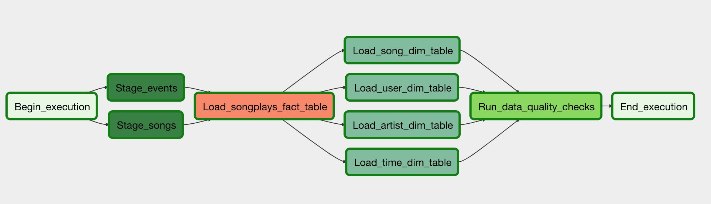

# Data Pipelines with Airflow

## Purpose
Sparkify a music streaming company wants to automate thier ETL pipleline using Apache Airflow 

## Goal Acheived 
Built a Data pipeline that is optimized to support reusable tasks, can be monitored and also allow for backfills,
also included are data quality checks which are run against the datasets after ETL steps are completed for data quality assurance.

## Data Input 
- Load data from S3 into Amazon Redshift warehouse
- 2 S3 data sets are used, song CSV files  `s3://udacity-dend/song_data`
- Event data as json files of what users are listening to `s3://udacity-dend/log_data`.
- Perform data quality checks on tables created on redshift

## AirFlow Components - Project Structure
- `Dag`: Contains all task to be run
- `Operators`: Operator templates (dedicated tasks)
- `Helpers`: SQL files with different trasformations

## AirFlow Tasks
The following tasks will be created in Airflow
- `StageToRedshiftOperator`: For stage data from s3 to tables in redshift 
- `LoadDimensionOperator`: For loading data  to dimension tables on redshift
- `LoadFactOperator`: For loading data into facts table on redshift 
- `DataQualityOperator` : For performing data quality checks.

## Expected Airflow Dependency Graph 
Below is the Sparkify Airflow dependency graph

